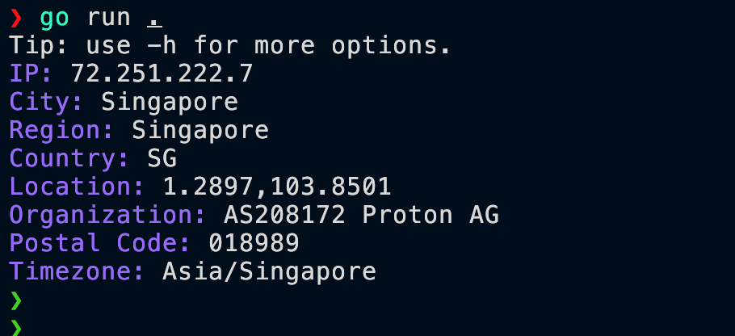
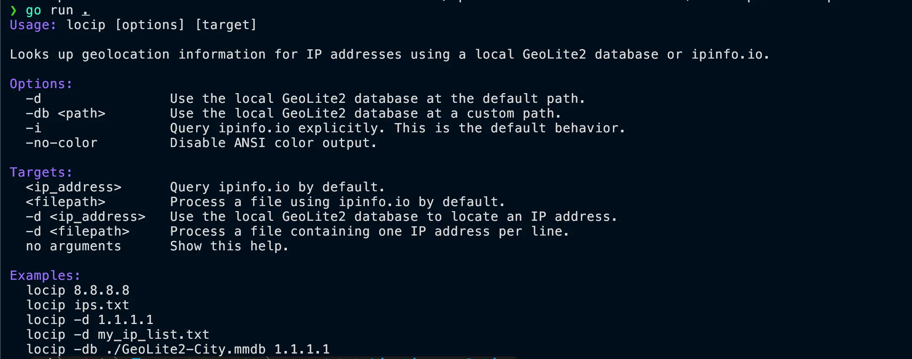

# locip



`locip` is a small Go CLI for IP geolocation lookups.

It supports two lookup modes:

- **ipinfo.io** for online lookups (default behavior)
- **GeoLite2 City** for local database lookups with `-d` or `-db`

## Features

- Online IP lookup through `ipinfo.io`
- Local GeoLite2 City database lookup
- Batch processing from files
- ANSI colored output using **red, blue, and yellow**
- `NO_COLOR` and `-no-color` support
- Simple single-binary CLI

## Installation

### Build locally

```bash
go build -o locip .
```

### Run without installing

```bash
go run . -h
```

## Usage

Current menu:



```text
Usage: locip [options] [target]

Looks up geolocation information for IP addresses using a local GeoLite2 database or ipinfo.io.

Options:
  -d                Use the local GeoLite2 database at the default path.
  -db <path>        Use the local GeoLite2 database at a custom path.
  -no-color         Disable ANSI color output.

Targets:
  <ip_address>      Query ipinfo.io by default.
  <filepath>        Process a file using ipinfo.io by default.
  -d <ip_address>   Use the local GeoLite2 database to locate an IP address.
  -d <filepath>     Process a file containing one IP address per line.
  no arguments      Query your current public IP using ipinfo.io.

Database:
  locipinst              # Run this command to install/update the GeoLite2 database (if locipinst script is available)

Examples:
  locip 8.8.8.8
  locip
  locip ips.txt
  locip -d 1.1.1.1
  locip -d my_ip_list.txt
  locip -db ./GeoLite2-City.mmdb 1.1.1.1
```

## Examples

### Online lookup with ipinfo.io

```bash
./locip 8.8.8.8
```

### Current public IP lookup

```bash
./locip
```

### Batch lookup from file using ipinfo.io

```bash
./locip ips.txt
```

### Local GeoLite2 lookup

```bash
./locip -d 1.1.1.1
```

### Local GeoLite2 lookup with custom database path

```bash
./locip -db ./GeoLite2-City.mmdb 1.1.1.1
```

### Batch lookup from file using the local database

```bash
./locip -d my_ip_list.txt
```

### Disable color output

```bash
./locip -no-color 8.8.8.8
```

Or with environment variable:

```bash
NO_COLOR=1 ./locip 8.8.8.8
```

## Local database

By default, `locip` expects the GeoLite2 City database at:

```text
/opt/4rji/GeoLite2-City.mmdb
```

If your database lives somewhere else, pass it with `-db`:

```bash
./locip -db /path/to/GeoLite2-City.mmdb 1.1.1.1
```

If the `locipinst` helper is available in your system, run it to install or update the GeoLite2 database:

```bash
locipinst
```

## File input format

When using a file as target, `locip` expects one IP per line.

Example:

```text
8.8.8.8
1.1.1.1
208.67.222.222
```

Blank lines and lines starting with `#` are ignored.

## Notes

- Online mode accepts a single target at a time.
- Local mode supports a single IP or a file containing IPs.

## Project structure

- `locip.go` — main CLI, argument parsing, output formatting, ipinfo.io requests, and GeoLite2 processing
- `locip_test.go` — tests for CLI behavior and request handling

## Dependency

- `github.com/oschwald/geoip2-golang`
